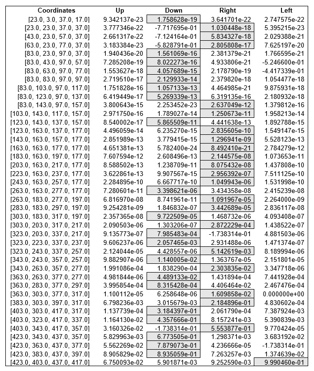
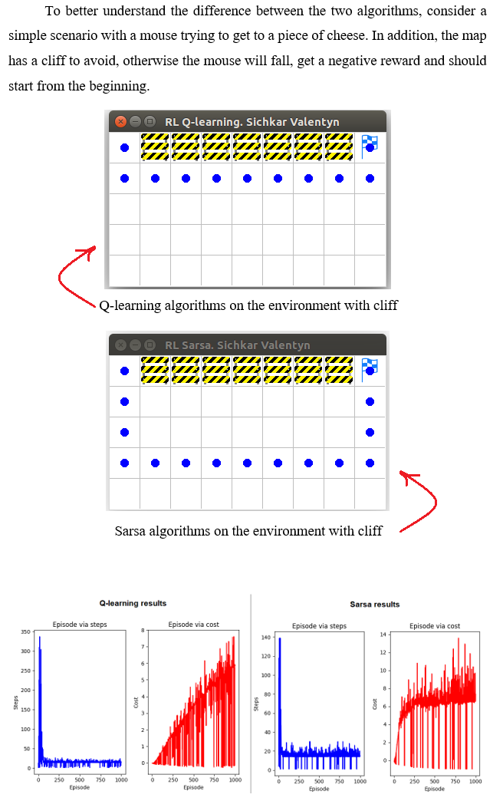

# Reinforcement Learning in Python
Implementing Reinforcement Learning (RL) Algorithms for global path planning in tasks of mobile robot navigation

### Reference to:
[1] Valentyn N Sichkar. Reinforcement Learning Algorithms for global path planning // GitHub platform [Electronic resource]. URL: https://github.com/sichkar-valentyn/Reinforcement_Learning_in_Python (date of access: XX.XX.XXXX)

## Description
RL Algorithms implemented in Python for the task of global path planning for mobile robot. Such system is said to have feedback. The agent acts on the environment, and the environment acts on the agent. At each step the agent:
* Executes action.
* Receives observation (new state).
* Receives reward.

The environment:
* Receives action.
* Emits observation (new state).
* Emits reward.

Goal is to learn how to take actions in order to maximize the reward. The objective function is as following:

Q[s, a] = Q[s, a] + λ * (r + γ * max (Q[s_, a_]) – Q[s, a]),

where,
 s – current position of the agent,
 a – current action,
 λ – learning rate,
 r – reward that is got in the current position,
 γ – gamma (reward decay, discount factor),
 s_ - next chosen position according to the next chosen action,
 a_ - next chosen action.

The major component of the RL method is the table of weights - Q-table of the system state. Matrix Q is a set of all possible states of the system and the system response weights to different actions. During trying to go through the given environment, mobile robot learns how to avoid obstacles and find the path to the destination point. As a result, the Q-table is built. Looking at the values of the table it is possible to see the decision for the next action made by agent (mobile robot).

 Experimental results with different Environments sre shown and described below.
 Code is supported with a lot of comments. It will guide you step by step through entire idea of implementation.
 
 Each example consists of three files:

* _env.py_ - building an environment with obstacles.
* _agent_brain.py_ - implementation of algorithm itself.
* _run_agent.py_ - running the experiments.

## Content
Codes (it'll send you to appropriate folder):
* [RL_Q-Learning_E-1](https://github.com/sichkar-valentyn/Reinforcement_Learning_in_Python/tree/master/RL_Q-Learning_E1)
* [RL_Q-Learning_E-2](https://github.com/sichkar-valentyn/Reinforcement_Learning_in_Python/tree/master/RL_Q-Learning_E2)
* [RL_Q-Learning_E-3](https://github.com/sichkar-valentyn/Reinforcement_Learning_in_Python/tree/master/RL_Q-Learning_E3)
* [RL_Sarsa_E-1](https://github.com/sichkar-valentyn/Reinforcement_Learning_in_Python/tree/master/RL_Sarsa_E1)
* [RL_Sarsa_E-2](https://github.com/sichkar-valentyn/Reinforcement_Learning_in_Python/tree/master/RL_Sarsa_E2)

 
Experimental results (figures and tables on this page):

* <a href="#RL Q-Learning Environment-1. Experimental results">RL Q-Learning Environment-1. Experimental results</a>
* <a href="#Q-learning algorithm resulted chart for the environment-1">Q-learning algorithm resulted chart for the environment-1</a>
* <a href="#Final Q-table with values from the final shortest route for environment-1">Final Q-table with values from the final shortest route for environment-1</a>
* <a href="#RL Q-Learning Environment-2. Experimental results">RL Q-Learning Environment-2. Experimental results</a>
* <a href="#Q-learning algorithm resulted chart for the environment-2">Q-learning algorithm resulted chart for the environment-2</a>
* <a href="#Final Q-table with values from the final shortest route for environment-1">Final Q-table with values from the final shortest route for environment-1</a>
* <a href="#RL Q-Learning Environment-3. Experimental results">RL Q-Learning Environment-3. Experimental results</a>
* <a href="#Comparison analysis of Q-Learning and Sarsa algorithms">Comparison analysis of Q-Learning and Sarsa algorithms</a>

 

### <a name="RL Q-Learning Environment-1. Experimental results">RL Q-Learning Environment-1. Experimental results</a>
Environment-1 with mobile robot, goal and obstacles

 

### <a name="Q-learning algorithm resulted chart for the environment-1">Q-learning algorithm resulted chart for the environment-1</a>
Represents number of episodes via number of steps and number of episodes via cost for each episode

### <a name="Final Q-table with values from the final shortest route for environment-1">Final Q-table with values from the final shortest route for environment-1</a>

 Looking at the values of the table we can see the decision for the next action made by agent (mobile robot). The sequence of final actions to reach the goal after the Q-table is filled with knowledge is the following: *down-right-down-down-down-right-down-right-down-right-down-down-right-right-up-up.*
 During the experiment with Q-learning algorithm the found shortest route to reach the goal for the environment-1 consist of 16 steps and the found longest rout to reach the goal consists of 185 steps.

 

### <a name="RL Q-Learning Environment-2. Experimental results">RL Q-Learning Environment-2. Experimental results</a>
Bigger environment-2 with more obstacles

### <a name="Q-learning algorithm resulted chart for the environment-2">Q-learning algorithm resulted chart for the environment-2</a>
Represents number of episodes via number of steps and number of episodes via cost for each episode

### <a name="Final Q-table with values from the final shortest route for environment-1">Final Q-table with values from the final shortest route for environment-1</a>

 

### <a name="RL Q-Learning Environment-3. Experimental results">RL Q-Learning Environment-3. Experimental results</a>
Super complex environment-3 with a lot of obstacles

 

### <a name="Comparison analysis of Q-Learning and Sarsa algorithms">Comparison analysis of Q-Learning and Sarsa algorithms</a>

## MIT License
## Copyright (c) 2018 Valentyn N Sichkar
## github.com/sichkar-valentyn
### Reference to:
[1] Valentyn N Sichkar. Reinforcement Learning Algorithms for global path planning // GitHub platform [Electronic resource]. URL: https://github.com/sichkar-valentyn/Reinforcement_Learning_in_Python (date of access: XX.XX.XXXX)
